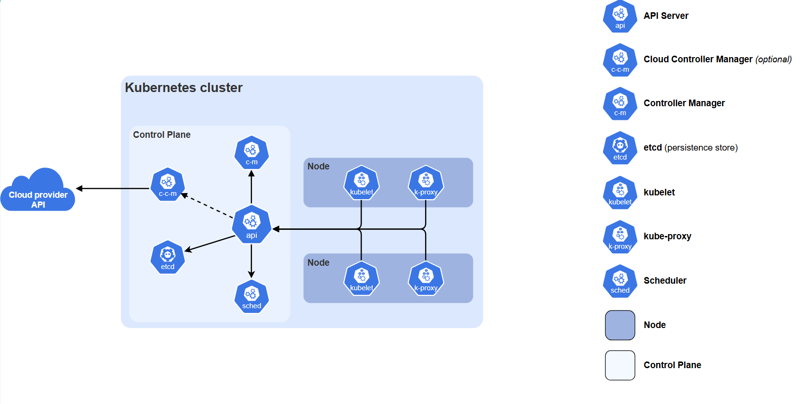

# Befehle

Übersicht über den Cluster: `kubectl --kubeconfig=.\kubeconfig-admin.conf --insecure-skip-tls-verify=true get all -A`
Namespace erstellen: `kubectl --kubeconfig=.\kubeconfig-admin.conf --insecure-skip-tls-verify=true create namespace asdf`
Namespaces abfragen: `kubectl --kubeconfig=.\kubeconfig-admin.conf --insecure-skip-tls-verify=true get namespaces`
Namespace abfragen: `kubectl --kubeconfig=.\kubeconfig-admin.conf --insecure-skip-tls-verify=true get namespace/asdf`
Alias setzen: `alias k="kubectl --kubeconfig=./kubeconfig-admin.conf --insecure-skip-tls-verify=true"`

Dies kann man von jetzt an in den Befehlen weglassen: --kubeconfig=.\kubeconfig-admin.conf --insecure-skip-tls-verify=true

## Um eine Shell zu erstellen, die innerhalb eures Namespace läuft und eine IP im Pod-Netzwerk hat:

`kubectl run tmp-shell --rm -it --image=docker.io/nicolaka/netshoot`

https://kubernetes.io/docs/tutorials/kubernetes-basics/deploy-app/deploy-intro/#kubectl-basics

# Grundsyntax von kubectl Kommandos

`kubectl [befehl] [TYP] [NAME] [flags]`

Wobei befehl, TYP, NAME und flags Folgendes sein können:

- befehl: Gibt die Operation an, die Sie an einer oder mehreren Ressourcen durchführen möchten, zum Beispiel create, get, describe, delete.

- TYP: Gibt den Ressourcentyp an. Ressourcentypen sind nicht case-sensitive und Sie können die Singular-, Plural- oder abgekürzte Form angeben. Die folgenden Befehle erzeugen beispielsweise dieselbe Ausgabe:

```
kubectl get pod pod1  
kubectl get pods pod1  
kubectl get po pod1
```
- NAME: Gibt den Namen der Ressource an. Bei Namen wird zwischen Gross- und Kleinschreibung unterschieden. Wenn der Name weggelassen wird, werden Details für alle Ressourcen mit dem Typen TYP angezeigt, zum Beispiel kubectl get pods.

- flags: Gibt optionale Flags an. Sie können beispielsweise die Flags -n oder --namespace verwenden, um in einem anderen Namespace zu handeln.

# Container Starten mit kubectl run

Um einen Container zu starten müssen wir einen Pod erstellen.

Als Platzhalter- oder Beispiel-Applikation verwenden wir diesmal Podinfo. Das hat den Vorteil eines knuffigen Maskott--ich mach nur Witze. Diese Applikation zeigt unter anderem an, wie der Pod heisst, der gerade antwortet. Damit können wir ein paar

`kubectl run kubectl-run-test --image=stefanprodan/podinfo:6.9.1 --port=9898`

Okay, was jetzt?? Mit dem nächsten Kommando können wir einen Port von unserem Rechner bis zu einem Pod durchschleusen:

# Port durchschleusen mit kubectl port-forward

`kubectl port-forward pods/kubectl-run-test 8000:9898`

Der Port links vom Doppelpunkt ist lokal, der Port rechts davon ist am Pod. Das heisst wir können jetzt mit dem Browser darauf zugreifen. Der Hostname ist http://localhost und der Port ist 8000.

Kubectl port-forward kann nicht nur Pods, sondern auch Services und Deployments annehmen. Technisch wird aber trotzdem immer nur ein Pod ausgewählt (der erste, der zum Service oder Deployment gehört). Das bedeutet: Es gibt kein echtes Forwarding zum Service-Port und kein Load-Balancing über mehrere Pods. Hintergrund: Ursprünglich war port-forward nur für Pods gedacht, die Entwickler haben das Verhalten später „erweitert“, ohne die Logik komplett umzubauen. Kurzfassung: kubectl port-forward verbindet sich immer nur mit einem Pod, nie wirklich mit einem Service.

# Service erstellen

So erstellt man den Service:

`kubectl expose pod/mypod --port=<SERVICE-PORT> --target-port=<ZIEL-PORT>`

Und so das port forwarding um über localhost zu connecten:

`kubectl port-forward service/podinfo-manuell 8080:80`

Alle services anzeigen: `kubectl get service`

Service über einen curl Befehl erreichen: `curl http://multi-podinfo.laura-dubach.svc.cluster.local`

Wenn sich der Service im gleichen Namespace befindet, reicht der Servicename aus. 
Das funktioniert weil sich '<namespace>.svc.cluster.local' im sogenannten
DNS Suchpfad befindet. Das könnt ihr in jedem container unter /etc/resolv.conf
nachschauen:

> cat /etc/resolv.conf 
search laura-dubach.svc.cluster.local svc.cluster.local cluster.local
nameserver 10.96.0.10

Wie hier sichtbar, ist 'svc.cluster.local' und 'cluster.local' auch im Suchpfad.

# Mehrere Instanzen einer Applikation Starten mit Deployments

1. Deployment erstellen
```
kubectl create deployment multi-podinfo \
  --image=stefanprodan/podinfo:6.9.1 \
  --replicas=3
```

2. Service erstellen (z. B. ClusterIP, Standard-Port 9898, den Podinfo nutzt)
```
kubectl expose deployment multi-podinfo \
  --port=80 \
  --target-port=9898
```

Ergebnis:

- Das Deployment multi-podinfo läuft mit 3 Pods.
- Der Service leitet den Traffic von Port 80 auf den Container-Port 9898 der Pods weiter.

So habe ich das port forwarding gemacht um über localhost zu connecten:

`kubectl port-forward deployment/multi-podinfo 8080:9898`

# Replicaset managen

`kubectl rollout`

```
history       View rollout history
  pause         Mark the provided resource as paused
  restart       Restart a resource
  resume        Resume a paused resource
  status        Show the status of the rollout
  undo          Undo a previous rollout
```
# Kubernetes Resourcen als YAML-Dateien

Ein Deployment ausgeben:

`kubectl create deployment <DEPLOYMENT_NAME> --image=<IMAGE_NAME> --dry-run=client`

Dem Cluster übergeben:

`kubectl apply -f <DATEI_NAME>`

Nun sieht man unter k9s das neue deployment

# Argo erklärung

Stell dir vor, du hast ein Heft (Git-Repository):

In diesem Heft schreibst du ganz genau auf, wie deine App im Kubernetes-Cluster aussehen soll (z. B. wie viele Pods, welches Image, welche Umgebungsvariablen).

Dieses Heft ist also deine Single Source of Truth = die Wahrheit, wie es sein soll.

Normalerweise ohne Argo CD:

Du müsstest selbst hingehen und die Sachen aus dem Heft (YAML-Files) manuell in den Cluster reinwerfen (kubectl apply).

Wenn du etwas änderst, musst du wieder manuell loslaufen.

Vergisst du es oder machst Tippfehler → Chaos.

Mit Argo CD:

Argo CD ist wie ein Roboter-Hausmeister, der ständig:

In dein Heft (Git) schaut → „Wie soll es sein?“

In den Cluster schaut → „Wie ist es gerade?“

Wenn’s nicht passt, repariert er es automatisch oder sagt dir Bescheid.

Warum ist das cool?

Du musst nicht mehr ins Cluster reinfummeln → alles wird über Git gesteuert.

Änderungen sind nachvollziehbar: Wer hat wann was geändert? (Git-Log).

Rückgängig machen? Einfach im Git die Änderung zurückdrehen → Argo CD stellt den alten Zustand wieder her.

👉 Merksatz:
Argo CD = der Git-Polizist fürs Kubernetes-Cluster.
Es sorgt dafür, dass der Cluster immer so aussieht, wie es in Git beschrieben ist – nicht mehr, nicht weniger.

# Aufbau Kubernetes:



## Push Image to Ducker Hub
 
Login in Docker Hub über Browser und repository erstellt
 
cd into src folder
 
docker login
 
docker build -t lauradubach/musicfinder:latest -f Dockerfile.prod .
 
docker buildx build -t lauradubach/musicfinder:latest -f Dockerfile.prod .
 
docker push lauradubach/musicfinder:latest
